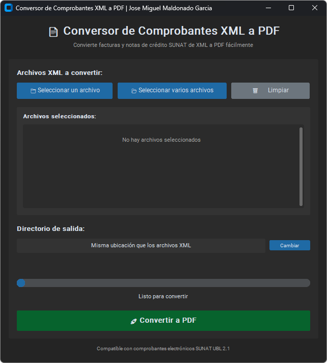

# Factura PDF Converter


> Windows desktop app that converts SUNAT electronic invoices and credit notes (XML UBL 2.1) to PDF, using XSLT transformation and Chromium rendering.

## Screenshot

<p align="center">
  
</p>

## Overview

A modern desktop application to convert SUNAT electronic invoices from XML (UBL 2.1) to PDF. It renders the documents through the official SUNAT XSL/CSS templates and prints them to PDF with a Chromium engine for a result that closely matches the browser. Invoices of any series (E, F, FF, ...) and credit notes are supported; boletas de venta (`InvoiceTypeCode = 03`) are detected and skipped with a warning.

## Features

- **Modern, intuitive GUI** built with CustomTkinter.
- **Single-file or batch conversion** of XML documents.
- Supports SUNAT UBL 2.1 **invoices and credit notes of all series** (E, F, FF, etc.).
- **Boleta de venta detection**: skipped with a warning at the end of the run (not supported yet).
- **Custom output directory** selection.
- **Real-time progress bar** and friendly error handling.
- **Chromium-based PDF rendering** for browser-faithful output, with `xhtml2pdf` as fallback.
- **Automatic recovery** for XML files with minor syntax errors.
- **"Información de la detracción" section** generated from the XML (legend, good/service code and description, payment method, bank account, percentage, amount).
- **SUNAT Catalog 54** mapping for detraction types (current codes) in the XSL template.
- **Activity log** written to `logs/factura_converter.log` for diagnostics.

## Tech Stack

- **Python 3.10+** (developed on 3.14) with `customtkinter`, `lxml`, `xhtml2pdf` and `playwright` (Chromium).
- XSLT transformation with the official SUNAT templates (`templates/`).
- Tests with `pytest`.

## Requirements

- Windows 10/11.
- Python 3.10 or higher.
- Chromium (downloaded automatically by `install.bat` via Playwright).

## Installation

### Option 1: Automatic installer (recommended)

1. Open a terminal (cmd) in the project folder.
2. Run the installer:
   ```batch
   install.bat
   ```
3. Wait for the installation to finish, then run the app:
   ```batch
   run.bat
   ```

### Option 2: Manual installation

1. Create a virtual environment:
   ```bash
   python -m venv venv
   ```
2. Activate it:
   ```bash
   venv\Scripts\activate
   ```
3. Install the dependencies:
   ```bash
   pip install -r requirements.txt
   ```
4. Install Chromium for the PDF engine:
   ```bash
   python -m playwright install chromium
   ```
5. Run the app:
   ```bash
   python run.py
   ```

## Usage

After installation, just double-click **`run.bat`** (recommended — it sets the correct working directory), or run from the project root:

```bash
venv\Scripts\python run.py
```

1. **Select XML files**:
   - Click "Seleccionar un archivo" to convert a single file.
   - Click "Seleccionar varios archivos" to convert multiple files.
2. **Choose an output directory** (optional):
   - By default, PDFs are saved next to their source XML files.
   - Click "Cambiar" to pick another directory.
3. **Convert**:
   - Click "Convertir a PDF" and wait for the conversion to finish.

> **Note:** Invoices of any series and credit notes are converted. If a **boleta de venta** slips into the selection, it is NOT converted: it is skipped and listed in a warning at the end. A damaged or unreadable XML is reported as an **error** (not as skipped) and logged in `logs/factura_converter.log`.

### Quick console test (no GUI)

To validate that the conversion engine works:

```bash
venv\Scripts\python -c "from src.converter import FacturaConverter; c=FacturaConverter(); print(c.convert('example/Factura/FACTURAE001-34420612069388.XML', 'test_output/prueba_manual.pdf'))"
```

### Automated tests

The project includes a `pytest` suite covering the conversion logic:

```bash
venv\Scripts\pip install -r requirements-dev.txt
venv\Scripts\python -m pytest tests/ -v
```

## Project Structure

```
factura_pdf_converter/
├── src/
│   ├── converter.py        # XML → XSLT → HTML → PDF conversion logic
│   └── main.py             # GUI (CustomTkinter), threading, logging
├── templates/
│   ├── factura2.1.xsl      # XSLT template for invoices
│   ├── ebxml21.css         # Invoice styles
│   ├── nota_credito.xsl    # XSLT template for credit notes
│   └── nota_credito.css    # Credit note styles
├── tests/                  # Automated tests (pytest)
├── logs/                   # Application logs (created at runtime, not versioned)
├── example/                # Personal example files (not versioned)
├── test_output/            # Test outputs (not versioned)
├── run.py                  # Startup script
├── run.bat                 # Windows startup script
├── install.bat             # Windows installer script
├── requirements.txt        # Python dependencies
├── requirements-dev.txt    # Development dependencies (tests)
└── README.md
```

## Troubleshooting

### "XSL template not found" error

Make sure `factura2.1.xsl`, `nota_credito.xsl` and their CSS files are in the `templates/` folder.

### Conversion error

Verify that the XML is a valid SUNAT invoice in UBL 2.1 format. Files with minor syntax errors are recovered automatically; heavily damaged or incomplete files fail and are reported as errors (with details in `logs/factura_converter.log`).

### Detraction code without description

The app maps the current SUNAT Catalog 54. If an XML contains a new code not covered by the template, it is shown as unmapped and the template must be updated.

### Missing Chromium

The default engine is Chromium; install/reinstall it with:

```bash
venv\Scripts\python -m playwright install chromium
```

### The app does not start / "No module named 'src'"

- Always run from the project folder (or use `run.bat`, which handles it automatically).
- If the venv was created with another Python version (e.g. after upgrading Python), delete it and recreate it:
  ```bash
  rmdir /s /q venv
  install.bat
  ```

## Notes

- The app uses the XSL and CSS templates provided by SUNAT to keep the official invoice format.
- Compatible with electronic invoices and credit notes of any series. Boletas de venta are not converted (skipped with a warning).
- The default PDF engine is `auto`: it tries Chromium first and falls back to `xhtml2pdf` if Chromium is unavailable.
- Pillow, pypdf and packaging are installed automatically as transitive dependencies of customtkinter and xhtml2pdf.
- The `example/` folder is for personal use and excluded from version control.

## Changelog

- Removed the Series E restriction: invoices of any series and credit notes are now converted.
- Boletas de venta (`InvoiceTypeCode = 03`) are detected and skipped with a warning.
- Corrupt XML is now reported as an error, never as "skipped".
- Batch conversions reuse a single Chromium instance (faster).
- Conversion errors are logged to `logs/factura_converter.log`.
- Improved compatibility across series and providers with XML structure variations.
- Fixed "Sub total Ventas" calculation to avoid `NaN` when optional nodes are missing.
- Fixed "Monto neto pendiente de pago" calculation for detraction + credit scenarios.
- Added the "Información de la detracción" section (legend, good/service code and description, payment method, bank account, percentage, detraction amount).
- Mapped Catalog 54 (goods/services subject to SPOT) in the XSL template.
- Added recovery mode for mildly malformed XML.

## License

Distributed under the **PolyForm Noncommercial License 1.0.0** — free for
noncommercial use only. See [LICENSE](LICENSE) for the full license text.

Copyright (c) 2026 Jose Miguel Maldonado Garcia

## Author

**Jose Miguel Maldonado Garcia** — [@JoanMike](https://github.com/JoanMike)
